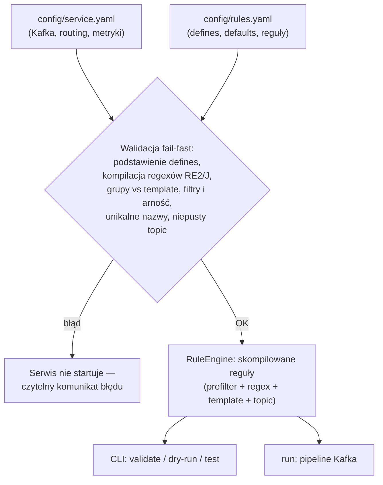
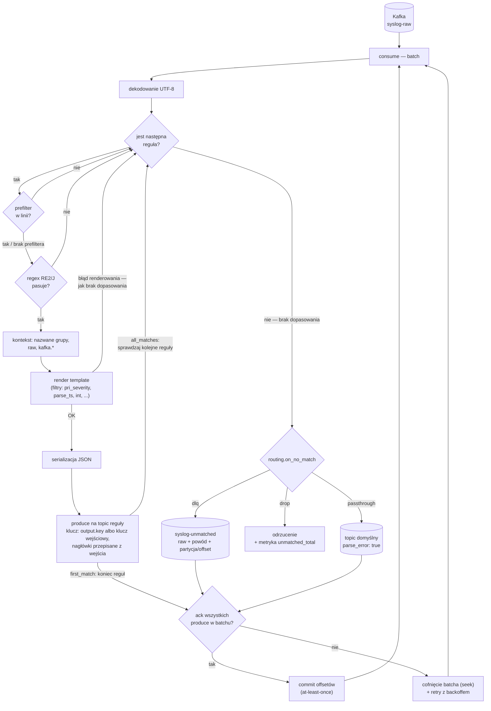

# syslog-parser

Serwis przetwarzania komunikatów syslog z urządzeń Cisco serii 8000 (IOS XR),
zaimplementowany w Javie (wymaga JDK 17+) i budowany Mavenem, według planu w
[`plan-syslog-parser.md`](plan-syslog-parser.md):

```
Kafka in → reguła (prefilter + regex + template + topic) → JSON → Kafka out
```

Nowe typy komunikatów obsługuje się przez dopisanie reguły w `config/rules.yaml`
— bez zmian w kodzie. Semantyka dostarczania: at-least-once (commit offsetu po
potwierdzeniu produce, producent idempotentny).

## Schemat blokowy

### Start serwisu i walidacja konfiguracji (fail-fast)



### Pętla przetwarzania (`run`)



## Budowanie

```bash
mvn package          # kompilacja + testy jednostkowe + golden testy + fat-jar
mvn test             # same testy
```

Wynik: `target/syslog-parser-<wersja>.jar` (uruchamialny, z zależnościami).

## Układ repozytorium

| Ścieżka | Zawartość |
|---|---|
| `config/service.yaml` | Kafka, routing (`first_match`/`all_matches`, `on_no_match`), port metryk |
| `config/rules.yaml`   | `defines`, `defaults.template`, uporządkowana lista reguł |
| `tests/golden.yaml`   | golden testy konfiguracji (bramka CI — uruchamiane też przez `mvn test`) |
| `src/main/java`       | kod serwisu |

## CLI

```bash
java -jar target/syslog-parser-0.1.0-SNAPSHOT.jar <komenda> [opcje]
```

| Komenda | Działanie |
|---|---|
| `validate` | tylko walidacja konfiguracji (fail-fast, czytelne komunikaty) |
| `dry-run "<linia>"` | wypisuje dopasowaną regułę, topic, klucz i JSON — bez Kafki; podstawowe narzędzie przy pisaniu reguł |
| `test` | uruchamia golden testy z `tests/golden.yaml` |
| `run` | uruchamia serwis (konsument → router → producent, metryki Prometheus) |

Domyślne opcje: `--config config/service.yaml`, `--rules config/rules.yaml`,
`--tests tests/golden.yaml`. `dry-run` przyjmuje dodatkowo `--clock <ISO8601>`
(zamrożenie zegara — przydatne, bo `parse_ts` uzupełnia brakujący rok z zegara).

Przykład:

```bash
java -jar target/syslog-parser-0.1.0-SNAPSHOT.jar dry-run \
  "<187>RP/0/RP0/CPU0:Aug 26 10:14:22.531 UTC: ifmgr[402]: %PKT_INFRA-LINK-3-UPDOWN : Interface HundredGigE0/0/0/0, changed state to Down"
```

## Język template'ów

Wartości w `template`, `output.key` i `defaults.template`:

- wartość bez `{{ }}` jest literałem (zachowuje typ z YAML),
- pojedyncze `{{ wyrażenie }}` zachowuje typ wyniku (int/bool/string),
- tekst mieszany interpoluje się do stringa.

Wyrażenia: zmienne (nazwane grupy regexa, `raw`, `kafka.key`, `kafka.partition`,
`kafka.offset`, `kafka.timestamp`), funkcja `now()`, porównanie `==`/`!=` oraz
filtry w potoku `|`:

`int`, `float`, `bool`, `lower`, `upper`, `trim`, `default(x)`,
`pri_severity`, `pri_facility`, `parse_ts(format, tz)` (format w stylu
strptime: `%b %d %H %M %S %f %Y %m`; brakujący rok uzupełniany z zegara,
z korektą przełomu roku).

Regexy kompilowane są silnikiem **RE2/J** — liniowym, bez katastrofalnego
backtrackingu (wymóg §5 planu). W regexach działa składnia `(?P<nazwa>...)`,
a `{{nazwa}}` podstawia fragmenty z sekcji `defines` przed kompilacją.

## Walidacja przy starcie (fail-fast)

Błędna konfiguracja = serwis nie startuje, np.:

```
rule "xr_link_updown": template uses group "iface" not present in regex
```

Sprawdzane: unikalność nazw reguł, kompilacja regexów (po podstawieniu
`defines`), istnienie wszystkich grup używanych w template'ach i `output.key`,
istnienie filtrów/funkcji i liczba ich argumentów, niepusty `output.topic`.
Nieużywane grupy tylko ostrzegają.

## Obsługa błędów w runtime

- brak dopasowania → wg `routing.on_no_match`: `dlq` (JSON z `raw`, powodem,
  partycją i offsetem), `drop` (tylko metryka) albo `passthrough`
  (`parse_error: true`),
- błąd renderowania template'u → traktowany jak brak dopasowania; nigdy nie
  zatrzymuje konsumenta,
- błąd produce → cofnięcie batcha i retry z backoffem; offset nie jest
  commitowany do skutku.

Klucz i nagłówki Kafka są przepisywane z wejścia na wyjście, chyba że reguła
definiuje własny `output.key`.

## Metryki (Prometheus, port z `metrics.port`)

`consumed_total`, `produced_total{rule,topic}`, `matched_total{rule}`,
`unmatched_total`, `dlq_total`, `template_errors_total{rule}`,
`processing_duration_seconds`, `last_processed_timestamp_seconds` (healthcheck).
